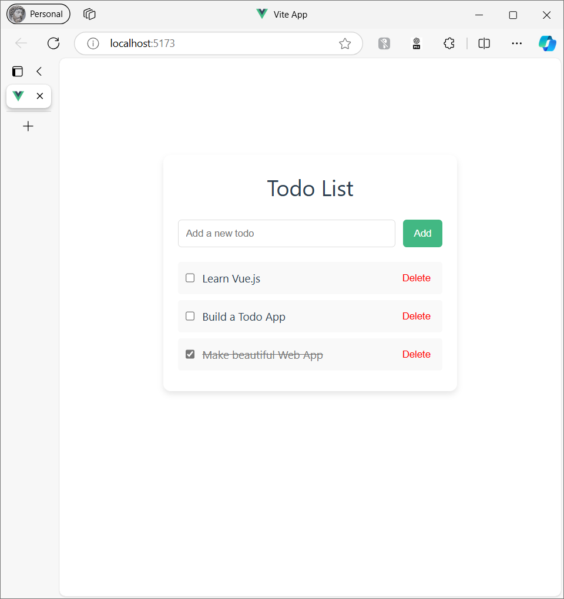

# Todo App with Vue and SASS

Ensure the structure of your project looks something like this:

```arduino
vue-todo-app/
├── src/
│   ├── assets/
│   ├── components/
│   │   └── TodoItem.vue
│   ├── App.vue
│   ├── main.js
├── public/
├── package.json
├── vite.config.js
```

### Step 3: Create TodoItem Component

Let's create a simple component to display individual Todo items.

1. **Create `TodoItem.vue`:** Inside the `src/components/` directory, create a new file `TodoItem.vue`:

   ```vue
   <template>
     <div class="todo-item">
       <input type="checkbox" v-model="todo.completed" />
       <span :class="{ completed: todo.completed }">{{ todo.text }}</span>
       <button @click="removeTodo">Delete</button>
     </div>
   </template>

   <script setup>
   defineProps({
     todo: Object,
     removeTodo: Function,
   });
   </script>

   <style lang="scss" scoped>
   .todo-item {
     display: flex;
     justify-content: space-between;
     align-items: center;
     padding: 10px;
     background-color: #f9f9f9;
     margin-bottom: 8px;
     border-radius: 4px;

     span {
       flex: 1;
       margin-left: 10px;
     }

     .completed {
       text-decoration: line-through;
       color: #777;
     }

     button {
       background: none;
       border: none;
       color: red;
       cursor: pointer;
     }
   }
   </style>
   ```

### Step 4: Update App.vue

Now, let's modify the `App.vue` to handle adding, deleting, and displaying Todo items.

1. **Replace the contents of `App.vue`:**

   ```vue
   <template>
     <div class="todo-app">
       <h1>Todo List</h1>
       <form @submit.prevent="addTodo">
         <input v-model="newTodo" type="text" placeholder="Add a new todo" />
         <button type="submit">Add</button>
       </form>

       <div class="todo-list">
         <TodoItem
           v-for="(todo, index) in todos"
           :key="index"
           :todo="todo"
           :removeTodo="() => removeTodo(index)"
         />
       </div>
     </div>
   </template>

   <script setup>
   import { ref } from "vue";
   import TodoItem from "./components/TodoItem.vue";

   // Reactive state
   const newTodo = ref("");
   const todos = ref([
     { text: "Learn Vue.js", completed: false },
     { text: "Build a Todo App", completed: false },
   ]);

   // Add a new todo
   const addTodo = () => {
     if (newTodo.value.trim()) {
       todos.value.push({
         text: newTodo.value,
         completed: false,
       });
       newTodo.value = "";
     }
   };

   // Remove a todo by index
   const removeTodo = (index) => {
     todos.value.splice(index, 1);
   };
   </script>

   <style lang="scss">
   .todo-app {
     max-width: 400px;
     margin: 100px auto;
     padding: 20px;
     border-radius: 10px;
     box-shadow: 0 4px 8px rgba(0, 0, 0, 0.1);
     background-color: #ffffff;
   }

   h1 {
     text-align: center;
     margin-bottom: 20px;
   }

   form {
     display: flex;
     justify-content: space-between;
     margin-bottom: 20px;

     input {
       flex: 1;
       padding: 10px;
       margin-right: 10px;
       border-radius: 5px;
       border: 1px solid #ddd;
     }

     button {
       padding: 10px 15px;
       background-color: #42b883;
       color: white;
       border: none;
       border-radius: 5px;
       cursor: pointer;

       &:hover {
         background-color: #38a06f;
       }
     }
   }

   .todo-list {
     margin-top: 20px;
   }
   </style>
   ```

### Step 5: Run the Application

Now that you've set up everything, start your Vue.js application by running:

```bash
npm run dev
```

Visit `http://localhost:3000` in your browser, and you should see a working Todo application!



### Explanation of Code

- **Vue Composition API** (`<script setup>`):

  - We use `ref` to create reactive state variables.
  - `newTodo` is a reactive string that holds the current input value for a new todo.
  - `todos` is a reactive array of todo objects.
  - We use methods like `addTodo` and `removeTodo` to manipulate these reactive state variables.

- **SCSS Styling**:

  - We are using SCSS to style the components with features like nesting.
  - SCSS allows us to create cleaner, more maintainable styles, and scoped styles ensure that the styles apply only to the respective components.
