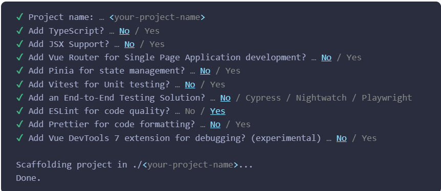

# Crash Course on Vue

---

### 1. **Create-Vue Setup**

Make sure you have an up-to-date version of Node.js installed and your current working directory is the one where you intend to create a project. Run the following command in your command line

**Installation & Setup:**

```bash
# Install Vue CLI
npm create vue@latest my-vue-app
```

This command will install and execute create-vue, the official Vue project scaffolding tool. You will be presented with prompts for several optional features such as TypeScript and testing support:



If you are unsure about an option, simply choose No by hitting enter for now. Once the project is created, follow the instructions to install dependencies and start the dev server:

```bash
# Navigate into your project

cd my-vue-app

# Install dependencies

npm install

# Start development server

npm run serve
```

After running `npm run serve`, you should see your app running at `http://localhost:8080`.

---

### 2. **ref() & Reactive Values**

In Vue 3, the Composition API introduces `ref()` and `reactive()` for managing state.

**Example using `ref()`:**

```js
<template>
  <div>
    <p>Count: {{ count }}</p>
    <button @click="increment">Increment</button>
  </div>
</template>

<script>
import { ref } from 'vue';

export default {
  setup() {
    const count = ref(0);
    const increment = () => {
      count.value++;
    };

    return { count, increment };
  },
};
</script>
```

- `ref()` wraps primitive values to make them reactive.
- Access the actual value via `.value`.

**Example using `reactive()`:**

```js
<template>
  <div>
    <p>{{ user.name }} (Age: {{ user.age }})</p>
    <button @click="growOlder">Grow Older</button>
  </div>
</template>

<script>
import { reactive } from 'vue';

export default {
  setup() {
    const user = reactive({ name: 'John', age: 30 });

    const growOlder = () => {
      user.age++;
    };

    return { user, growOlder };
  },
};
</script>
```

- `reactive()` wraps objects to make their properties reactive.

---

### 3. **v-if, v-else & v-else-if Directives**

These are used to conditionally render elements in the DOM.

**Example:**

```html
<template>
  <div>
    <p v-if="loggedIn">Welcome back!</p>
    <p v-else-if="loading">Loading...</p>
    <p v-else>You need to log in.</p>
  </div>
</template>

<script>
  export default {
    data() {
      return {
        loggedIn: false,
        loading: true,
      };
    },
  };
</script>
```

- `v-if` renders content based on a condition.
- `v-else-if` and `v-else` act as fallbacks.

---

### 4. **v-for Directive & Looping**

`v-for` is used to loop over data and render lists.

**Example:**

```html
<template>
  <ul>
    <li v-for="(item, index) in items" :key="index">{{ item }}</li>
  </ul>
</template>

<script>
  export default {
    data() {
      return {
        items: ["Apple", "Banana", "Orange"],
      };
    },
  };
</script>
```

- Use `v-for` to loop through an array.
- Always use `:key` to uniquely identify items in a list.

---

### 5. **v-bind Directive**

`v-bind` is used to bind HTML attributes dynamically.

**Example:**

```html
<template>
  
</template>

<script>
  export default {
    data() {
      return {
        imageUrl: "https://via.placeholder.com/150",
      };
    },
  };
</script>
```

- `v-bind` binds an expression to the attribute (e.g., `src`, `alt`, etc.).
- Shorthand for `v-bind` is `:`, e.g., `:src="imageUrl"`.

---

### 6. **v-on Directive, Events & Methods**

`v-on` is used to listen to events, like click, input, etc.

**Example:**

```html
<template>
  <button @click="handleClick">Click me</button>
</template>

<script>
  export default {
    methods: {
      handleClick() {
        alert("Button clicked!");
      },
    },
  };
</script>
```

- `v-on` is used to bind events like `click`.
- Shorthand for `v-on` is `@`, e.g., `@click="handleClick"`.

---

### 7. **Forms & v-model**

`v-model` creates two-way data binding between form elements and Vue's data.

**Example:**

```html
<template>
  <input v-model="name" placeholder="Enter your name" />
  <p>Hello, {{ name }}!</p>
</template>

<script>
  export default {
    data() {
      return {
        name: "",
      };
    },
  };
</script>
```

- `v-model` automatically syncs data between the input field and Vue’s data.

---

### 8. **Lifecycle Methods**

Vue components go through several lifecycle stages. Common lifecycle hooks:

- `created()`: Called when the component is created.
- `mounted()`: Called when the component is mounted to the DOM.
- `updated()`: Called when the component’s data changes.
- `beforeUnmount()`: Called before the component is destroyed.

**Example:**

```js
export default {
  created() {
    console.log("Component is created!");
  },
  mounted() {
    console.log("Component is mounted!");
  },
  beforeUnmount() {
    console.log("Component is about to be destroyed!");
  },
};
```

---

### 9. **onMounted & Fetching Data**

`onMounted` is part of the Composition API and is similar to the `mounted()` hook.

**Example:**

```html
<template>
  <div>
    <p v-if="loading">Loading data...</p>
    <p v-else>Data: {{ data }}</p>
  </div>
</template>

<script>
  import { ref, onMounted } from "vue";

  export default {
    setup() {
      const data = ref(null);
      const loading = ref(true);

      onMounted(async () => {
        const response = await fetch("https://api.example.com/data");
        const result = await response.json();
        data.value = result;
        loading.value = false;
      });

      return { data, loading };
    },
  };
</script>
```

- `onMounted()` runs when the component is mounted.
- Ideal for fetching data from APIs.

---

### 10. **Components and Props**

Components allow code reuse. You can pass data into components using props.

**Parent Component:**

```html
<template>
  <div>
    <ChildComponent :message="parentMessage" />
  </div>
</template>

<script>
  import ChildComponent from "./ChildComponent.vue";

  export default {
    data() {
      return {
        parentMessage: "Hello from the parent!",
      };
    },
    components: {
      ChildComponent,
    },
  };
</script>
```

**Child Component:**

```html
<template>
  <p>{{ message }}</p>
</template>

<script>
  export default {
    props: {
      message: String,
    },
  };
</script>
```

- The parent passes data to the child using `props`.
- The child accesses the passed data using the `props` object.

---

### 11. **Composition API**

The Composition API is a new way to organize Vue component logic. It provides better organization and reusability of code.

**Example:**

```html
<template>
  <div>
    <p>Count: {{ count }}</p>
    <button @click="increment">Increment</button>
  </div>
</template>

<script>
  import { ref } from "vue";

  export default {
    setup() {
      const count = ref(0);
      const increment = () => {
        count.value++;
      };

      return { count, increment };
    },
  };
</script>
```

- Instead of using the `data()`, `methods`, and `computed` options separately, the Composition API uses the `setup()` function to handle logic in one place.

---

This covers the basic crash course on Vue.js! Each of these examples demonstrates core concepts you'll need when building Vue apps.
